TTIC has a highly active theory group, including several tenure-track faculty and fixed-term research faculty. There are also significant interactions between the theory groups at TTIC and at the [University of Chicago](http://theory.cs.uchicago.edu).

### Faculty

|   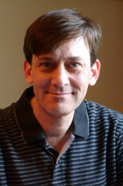    | 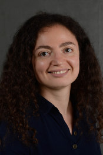 |    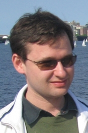    |  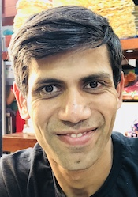   |                                                       |
| :----------------------------------------------------------: | :-----------------------------------------------------: | :----------------------------------------------------------: | :---------------------------------------------------------: | :---------------------------------------------------: |
|         [Avrim Blum](https://home.ttic.edu/~avrim/)          |     [Julia Chuzhoy](https://home.ttic.edu/~cjulia/)     |       [Yury Makarychev](https://home.ttic.edu/~yury/)        |     [Madhur Tulsiani](https://home.ttic.edu/~madhurt/)      |                                                       |
| 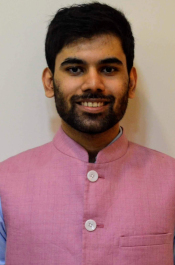  |  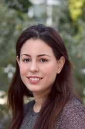  |   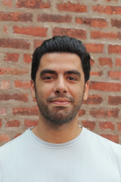    |   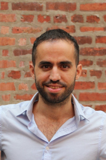    | 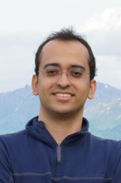 |
| [Siddharth Bhandari](https://sites.google.com/view/siddharth-bhandari/) |   [Lee Cohen](https://sites.google.com/view/leecohen)   | [Saeed Sharifi-Malvajerdi](https://sites.google.com/view/saeedsh/home) | [Ohad Trabelsi](https://sites.google.com/view/ohadtrabelsi) |    [Ali Vakilian](https://www.mit.edu/~vakilian/)     |

### Other Affiliated Faculty

|  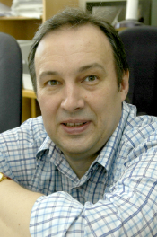  |  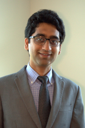  |    |      |      |
| :----------------------------------------------------------: | :----------------------------------------------------------: | :----------------------------------------------------------: | :--: | :--: |
| [Alexander Razborov](http://people.cs.uchicago.edu/~razborov/)   Adjoint Faculty | [Aditya Bhaskara](https://users.cs.utah.edu/~bhaskara/)   Visiting Faculty | [Eden Chlamtac](https://www.cs.bgu.ac.il/~chlamtac/)  Visiting Faculty |      |      |

### TTIC Students

|        |  |    |  |  |
| :----------------------------------------------------------: | :-----------------------------------------------------: | :----------------------------------------------------------: | :-------------------------------------------------------: | :---------------------------------------------------------: |
|                         Melissa Dutz                         |         [Naren Manoj](https://www.nsmanoj.com)          |                         Ron Mosenzon                         |     [Rachit Nimavat](https://home.ttic.edu/~nimavat/)     |             [Max Ovsiankin](https://maxov.org)              |
| 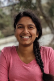 |   |  |   |                                                             |
|      [Kavya Ravichandran](https://kavyar314.github.io)       |    [Han Shao](https://sites.google.com/view/hanshao)    | [Shashank Srivastava](https://sites.google.com/view/shashanks) |     [Kevin Strangl](https://home.ttic.edu/~kstangl/)      |                                                             |

### UChicago Students (with TTIC advisors)

| 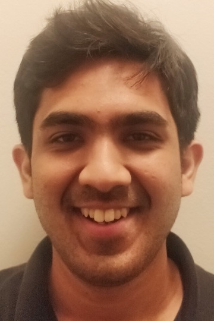 | 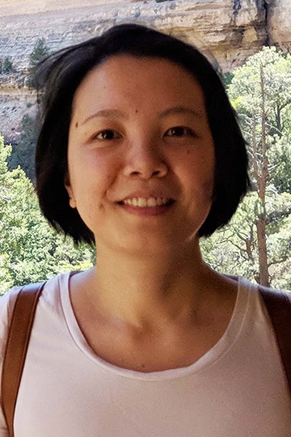 |      |      |      |
| :------------------------------------------------------: | :--------------------------------------------------: | :--: | :--: | :--: |
|    [Tushant Mittal](https://mittaltushant.github.io)     |                       June Wu                        |      |      |      |

### Recent Alumni

