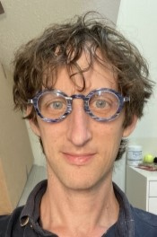

TTIC has a highly active theory group, including several tenure-track faculty and fixed-term research faculty. There are also significant interactions between the theory groups at TTIC and at the [University of Chicago](http://theory.cs.uchicago.edu).

### Faculty

|       |  |        |     |                                                       |
| :----------------------------------------------------------: | :-----------------------------------------------------: | :----------------------------------------------------------: | :---------------------------------------------------------: | :---------------------------------------------------: |
|         [Avrim Blum](https://home.ttic.edu/~avrim/)          |     [Julia Chuzhoy](https://home.ttic.edu/~cjulia/)     |       [Yury Makarychev](https://home.ttic.edu/~yury/)        |     [Madhur Tulsiani](https://home.ttic.edu/~madhurt/)      |                                                       |
|   |    |       |       |  |
| [Siddharth Bhandari](https://sites.google.com/view/siddharth-bhandari/) |   [Lee Cohen](https://sites.google.com/view/leecohen)   | [Saeed Sharifi-Malvajerdi](https://sites.google.com/view/saeedsh/home) | [Ohad Trabelsi](https://sites.google.com/view/ohadtrabelsi) |    [Ali Vakilian](https://www.mit.edu/~vakilian/)     |

### Other Affiliated Faculty

|    |    |    |      |      |
| :----------------------------------------------------------: | :----------------------------------------------------------: | :----------------------------------------------------------: | :--: | :--: |
| [Alexander Razborov](http://people.cs.uchicago.edu/~razborov/)   Adjoint Faculty | [Aditya Bhaskara](https://users.cs.utah.edu/~bhaskara/)   Visiting Faculty | [Eden Chlamtac](https://www.cs.bgu.ac.il/~chlamtac/)  Visiting Faculty |      |      |

### TTIC Students

### UChicago Students (with TTIC advisors)

### Recent Alumni

